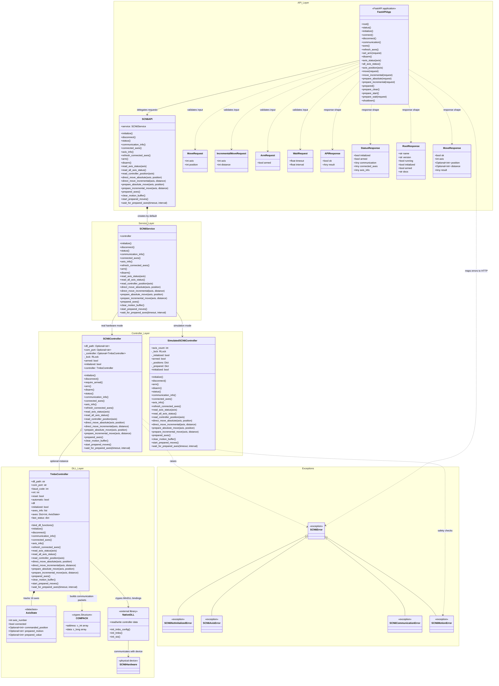

```mermaid

classDiagram
    direction TB

    %% =========================
    %% API LAYER
    %% =========================

    namespace API_Layer {
        class FastAPIApp {
            <<FastAPI application>>
            +root()
            +status()
            +initialize()
            +connect()
            +disconnect()
            +communication()
            +axes()
            +refresh_axes()
            +set_arm(request)
            +disarm()
            +axis_status(axis)
            +all_axis_status()
            +axis_position(axis)
            +move(request)
            +move_incremental(request)
            +prepare_absolute(request)
            +prepare_incremental(request)
            +prepared()
            +prepare_clear()
            +prepare_start()
            +prepare_wait(request)
            +shutdown()
        }

        class SCN6API {
            +service: SCN6Service
            +initialize()
            +disconnect()
            +status()
            +communication_info()
            +connected_axes()
            +axis_info()
            +refresh_connected_axes()
            +arm()
            +disarm()
            +read_axis_status(axis)
            +read_all_axis_status()
            +read_controller_position(axis)
            +direct_move_absolute(axis, position)
            +direct_move_incremental(axis, distance)
            +prepare_absolute_move(axis, position)
            +prepare_incremental_move(axis, distance)
            +prepared_axes()
            +clear_motion_buffer()
            +start_prepared_moves()
            +wait_for_prepared_axes(timeout, interval)
        }

        class MoveRequest {
            +int axis
            +int position
        }

        class IncrementalMoveRequest {
            +int axis
            +int distance
        }

        class ArmRequest {
            +bool armed
        }

        class WaitRequest {
            +float timeout
            +float interval
        }

        class APIResponse {
            +bool ok
            +Any result
        }

        class StatusResponse {
            +bool initialized
            +bool armed
            +Any communication
            +Any connected_axes
            +Any axis_info
        }

        class RootResponse {
            +str name
            +str version
            +bool running
            +bool initialized
            +bool armed
            +str docs
        }

        class MoveResponse {
            +bool ok
            +int axis
            +Optional~int~ position
            +Optional~int~ distance
            +Any result
        }
    }

    %% =========================
    %% SERVICE LAYER
    %% =========================

    namespace Service_Layer {
        class SCN6Service {
            +controller
            +initialize()
            +disconnect()
            +status()
            +communication_info()
            +connected_axes()
            +axis_info()
            +refresh_connected_axes()
            +arm()
            +disarm()
            +read_axis_status(axis)
            +read_all_axis_status()
            +read_controller_position(axis)
            +direct_move_absolute(axis, position)
            +direct_move_incremental(axis, distance)
            +prepare_absolute_move(axis, position)
            +prepare_incremental_move(axis, distance)
            +prepared_axes()
            +clear_motion_buffer()
            +start_prepared_moves()
            +wait_for_prepared_axes(timeout, interval)
        }
    }

    %% =========================
    %% CONTROLLER LAYER
    %% =========================

    namespace Controller_Layer {
        class SCN6Controller {
            +dll_path: Optional~str~
            +com_port: Optional~str~
            -_controller: Optional~TmbsController~
            -_lock: RLock
            +armed: bool
            +initialized: bool
            +controller: TmbsController
            +initialize()
            +disconnect()
            +require_armed()
            +arm()
            +disarm()
            +status()
            +communication_info()
            +connected_axes()
            +axis_info()
            +refresh_connected_axes()
            +read_axis_status(axis)
            +read_all_axis_status()
            +read_controller_position(axis)
            +direct_move_absolute(axis, position)
            +direct_move_incremental(axis, distance)
            +prepare_absolute_move(axis, position)
            +prepare_incremental_move(axis, distance)
            +prepared_axes()
            +clear_motion_buffer()
            +start_prepared_moves()
            +wait_for_prepared_axes(timeout, interval)
        }

        class SimulatedSCN6Controller {
            +axis_count: int
            -_lock: RLock
            -_initialized: bool
            +armed: bool
            -_positions: Dict
            -_prepared: Dict
            +initialized: bool
            +initialize()
            +disconnect()
            +arm()
            +disarm()
            +status()
            +communication_info()
            +connected_axes()
            +axis_info()
            +refresh_connected_axes()
            +read_axis_status(axis)
            +read_all_axis_status()
            +read_controller_position(axis)
            +direct_move_absolute(axis, position)
            +direct_move_incremental(axis, distance)
            +prepare_absolute_move(axis, position)
            +prepare_incremental_move(axis, distance)
            +prepared_axes()
            +clear_motion_buffer()
            +start_prepared_moves()
            +wait_for_prepared_axes(timeout, interval)
        }
    }

    %% =========================
    %% DLL / HARDWARE LAYER
    %% =========================

    namespace DLL_Layer {
        class TmbsController {
            +dll_path: str
            +com_port: str
            +baud_code: int
            +nrt: int
            +reset: bool
            +automatic: bool
            +dll
            +initialized: bool
            +axes_info: list
            +axes: Dict~int, AxisState~
            +last_status: dict
            +bind_dll_functions()
            +initialize()
            +disconnect()
            +communication_info()
            +connected_axes()
            +axis_info()
            +refresh_connected_axes()
            +read_axis_status(axis)
            +read_all_axis_status()
            +read_controller_position(axis)
            +direct_move_absolute(axis, position)
            +direct_move_incremental(axis, distance)
            +prepare_absolute_move(axis, position)
            +prepare_incremental_move(axis, distance)
            +prepared_axes()
            +clear_motion_buffer()
            +start_prepared_moves()
            +wait_for_prepared_axes(timeout, interval)
        }

        class AxisState {
            <<dataclass>>
            +int axis_number
            +bool connected
            +Optional~int~ commanded_position
            +Optional~str~ prepared_motion
            +Optional~int~ prepared_value
        }

        class COMPACK {
            <<ctypes.Structure>>
            +address: c_int array
            +data: c_long array
        }

        class NativeDLL {
            <<external library>>
            +init_tmbs_config()
            +init_tmbs()
            +init_sio()
            +read/write controller data
        }

        class SCN6Hardware {
            <<physical device>>
        }
    }

    %% =========================
    %% EXCEPTIONS
    %% =========================

    namespace Exceptions {
        class SCN6Error {
            <<exception>>
        }

        class SCN6NotInitializedError {
            <<exception>>
        }

        class SCN6AxisError {
            <<exception>>
        }

        class SCN6CommunicationError {
            <<exception>>
        }

        class SCN6MotionError {
            <<exception>>
        }
    }

    %% =========================
    %% API RELATIONSHIPS
    %% =========================

    FastAPIApp --> SCN6API : delegates requests
    FastAPIApp ..> MoveRequest : validates input
    FastAPIApp ..> IncrementalMoveRequest : validates input
    FastAPIApp ..> ArmRequest : validates input
    FastAPIApp ..> WaitRequest : validates input

    %% Response schemas are defined but not explicitly
    %% used as endpoint response_model in the current server.
    FastAPIApp ..> APIResponse : response shape
    FastAPIApp ..> StatusResponse : response shape
    FastAPIApp ..> RootResponse : response shape
    FastAPIApp ..> MoveResponse : response shape

    %% =========================
    %% SERVICE RELATIONSHIPS
    %% =========================

    SCN6API *-- SCN6Service : creates by default
    SCN6Service --> SCN6Controller : real hardware mode
    SCN6Service --> SimulatedSCN6Controller : simulation mode

    %% Both controller implementations provide the
    %% operations expected by SCN6Service.
    %% They do not inherit from a shared base class.

    %% =========================
    %% DLL RELATIONSHIPS
    %% =========================

    SCN6Controller o-- TmbsController : optional instance
    TmbsController *-- AxisState : tracks 16 axes
    TmbsController ..> COMPACK : builds communication packets
    TmbsController --> NativeDLL : ctypes.WinDLL bindings
    NativeDLL --> SCN6Hardware : communicates with device

    %% =========================
    %% ERROR RELATIONSHIPS
    %% =========================

    SCN6Error <|-- SCN6NotInitializedError
    SCN6Error <|-- SCN6AxisError
    SCN6Error <|-- SCN6CommunicationError
    SCN6Error <|-- SCN6MotionError

    SCN6Controller ..> SCN6Error : raises
    SCN6Controller ..> SCN6MotionError : safety checks
    FastAPIApp ..> SCN6Error : maps errors to HTTP
```